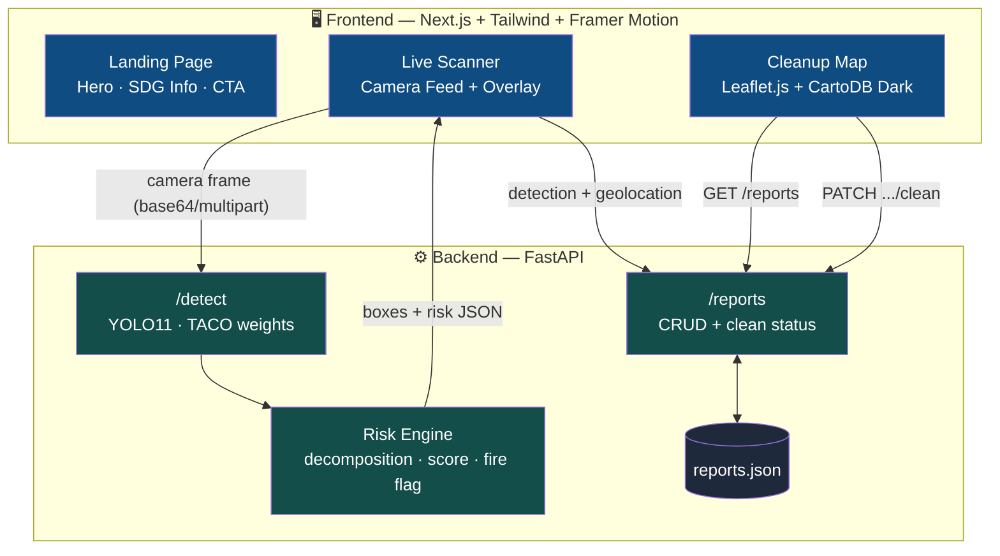
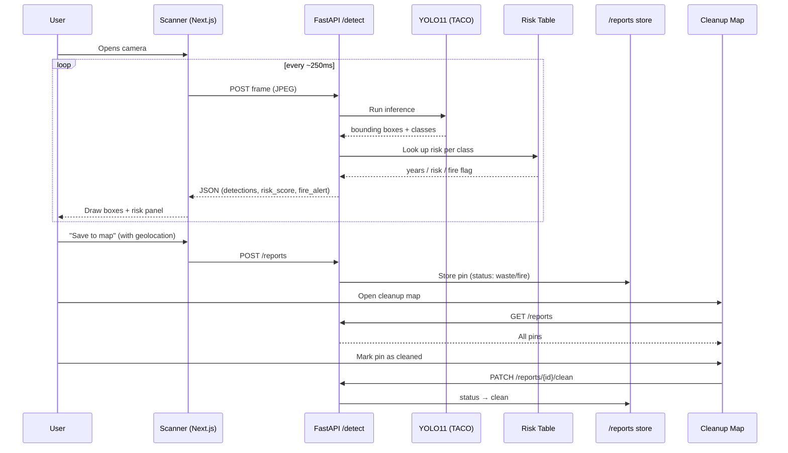

# 🐻‍❄️ PolarVision

**AI-powered litter detection for a melting world.**

PolarVision turns a live camera feed into an ecological risk report. Point it at litter on the ground — a plastic bottle, a cigarette butt, a shard of glass — and it detects it in real time, scores its ecological risk, and drops it on a shared cleanup map for volunteers and local teams to act on.

Built for the [Devpost Acodemic Hackathon](https://acodemic-hackathon.devpost.com/).

---

## 🌍 Why PolarVision

The poles are melting, and that can feel like a problem too vast for any one person to touch. But local pollution drives the same damage at a smaller, actionable scale: microplastics leach into soil, wildlife chokes on waste, and glass left in dry terrain can start wildfires through a lensing effect. PolarVision makes that connection visible in the time it takes to point a phone at the ground — and gives people a way to actually do something about it.

The polar bear is our mascot: the most recognizable symbol of a warming planet, and a reminder of what this project is ultimately protecting.

### 🎯 Sustainable Development Goals

| SDG | How PolarVision contributes |
|---|---|
| **SDG 12 — Responsible Consumption & Production** | Identifies waste in real time and routes it toward the correct recycling stream, turning passive awareness into an actionable habit. |
| **SDG 15 — Life on Land** | Flags ecological risk (decomposition time, wildlife hazard) and raises wildfire alerts for glass/metal waste in natural terrain, protecting terrestrial ecosystems. |

---

## ✨ Features

- 📷 **Live scan engine** — webcam or phone camera feed, analyzed in real time
- 🧠 **YOLO11 object detection** — fine-tuned on the [TACO](http://tacodataset.org/) (Trash Annotations in Context) dataset
- ⏳ **Ecological risk scoring** — every detected item is mapped to its decomposition time, ecological impact, and a 0–100 risk score
- 🔥 **Fire & safety alerts** — glass and metal detections trigger a confidence-gated wildfire risk warning
- 🗺️ **Community cleanup map** — Leaflet.js + dark CARTO basemap, with 🔴 fire / 🟡 waste / 🟢 clean pins
- ✅ **Cleanup logging** — mark a pin as cleaned by yourself, a volunteer team, or a municipal report
- 🐻‍❄️ **Animated landing page** — scroll-driven polar bear, built with Framer Motion

---

## 🏗️ Architecture



### Detection → Risk → Map flow



<br>


<br>

---

## 🧰 Tech Stack

**Frontend**
- Next.js (App Router) + TypeScript
- Tailwind CSS
- Framer Motion (scroll animations)
- Leaflet.js + react-leaflet (map)
- CARTO Dark Matter basemap

**Backend**
- FastAPI
- Ultralytics YOLO11 (`fabiocigaina/TACO-yolo11s`, trained on TACO)
- OpenCV / Pillow
- PyTorch (CUDA-accelerated inference)
- JSON-backed report store


PolarVision/
├── polarvision-backend/
│ ├── main.py # FastAPI app: /detect, /reports, /health
│ ├── risk_table.py # class → decomposition time, risk, fire flag
│ ├── reports.py # cleanup report storage (CRUD)
│ ├── weights/ # YOLO11 TACO model (not committed)
│ └── data/reports.json # persisted map pins
│
└── polarvision-frontend/
├── src/app/
│ ├── page.tsx # landing page (hero, SDG info, CTA)
│ └── scan/page.tsx # scanner + cleanup map
└── src/components/
├── Scanner.tsx # camera + detection overlay
├── SaveButton.tsx # geolocation → save report
├── ReportsMap.tsx # Leaflet map + clean-up flow
└── FloatingBear.tsx # scroll-driven polar bear animation


---

## 🚀 Getting Started

### Backend

```bash
cd polarvision-backend
python -m venv venv
venv\Scripts\activate          # Windows
# source venv/bin/activate     # macOS/Linux

pip install torch torchvision --index-url https://download.pytorch.org/whl/cu128
pip install -r requirements.txt

python -m uvicorn main:app --reload --port 8000
```

API docs available at `http://localhost:8000/docs`.

### Frontend

```bash
cd polarvision-frontend
npm install

# .env.local
echo "NEXT_PUBLIC_API_URL=http://localhost:8000" >> .env.local
echo "NEXT_PUBLIC_CARTO_KEY=<your-carto-basemaps-key>" >> .env.local

npm run dev
```

Open `http://localhost:3000`.

> Get a free CARTO basemaps API key at [carto.com/basemaps/apikey](https://carto.com/basemaps/apikey).

---

## 🗑️ Detection Classes & Risk Table

| Class | Decomposition time | Risk | Fire hazard |
|---|---|---|---|
| Cigarette | 10–12 years | 🔴 Critical | Yes |
| Bottle (plastic/glass) | 450 – 1,000,000+ years | 🟠 High | Possible (glass) |
| Plastic bag & wrapper | 10–1000 years | 🟠 High | No |
| Other plastic | 20–500 years | 🟠 High | No |
| Can | 200–500 years | 🟡 Medium | No |
| Cup | 20–50 years | 🟡 Medium | No |
| Bottle cap | ~450 years | 🟡 Medium | No |
| Carton | ~2 months – 5 years | 🟢 Low | No |
| Other | Unknown | 🟢 Low | No |

---

## 🔮 What's Next

- Fine-tune on user-submitted field photos to close the gap between TACO's training distribution and real-world outdoor conditions
- On-device / edge inference for offline use in remote natural areas
- Verified before/after photos for marked-clean pins
- Partner integrations for volunteer organizations and municipalities
- Expand detection to e-waste and larger dumping sites

---

## 🙏 Acknowledgements

- [TACO: Trash Annotations in Context](http://tacodataset.org/) dataset
- [`fabiocigaina/TACO-yolo11s`](https://huggingface.co/fabiocigaina) pretrained weights
- Map tiles © [OpenStreetMap](https://www.openstreetmap.org/copyright) contributors, © [CARTO](https://carto.com/attributions)


---

<p align="center">Built with 🧊 for SDG 12 & SDG 15</p>
---

## 📂 Project Structure
